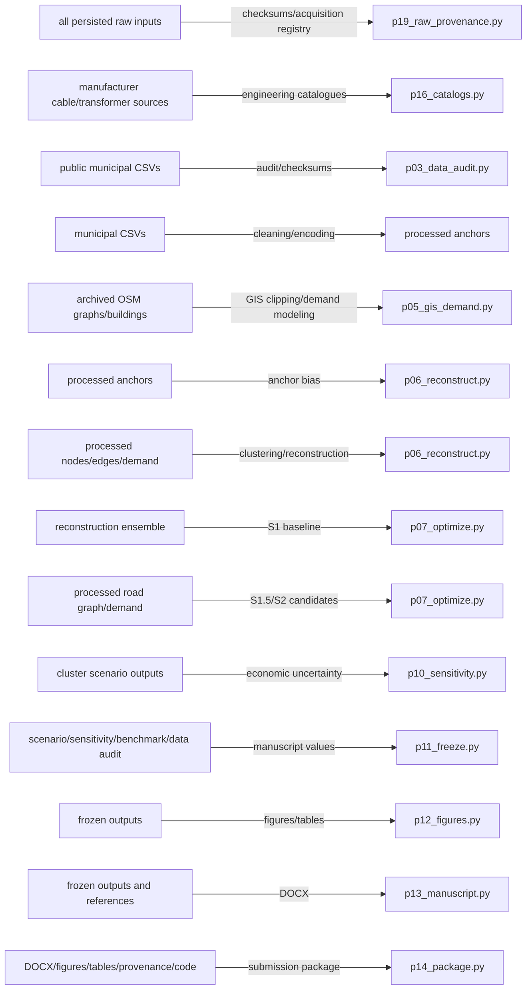

# Actual dependency DAG

```mermaid
flowchart LR
  N0["all persisted raw inputs"] -->|"checksums/acquisition registry"| M0["p19_raw_provenance.py"]
  N1["manufacturer cable/transformer sources"] -->|"engineering catalogues"| M1["p16_catalogs.py"]
  N2["public municipal CSVs"] -->|"audit/checksums"| M2["p03_data_audit.py"]
  N3["municipal CSVs"] -->|"cleaning/encoding"| M3["processed anchors"]
  N4["archived OSM graphs/buildings"] -->|"GIS clipping/demand modeling"| M4["p05_gis_demand.py"]
  N5["processed anchors"] -->|"anchor bias"| M5["p06_reconstruct.py"]
  N6["processed nodes/edges/demand"] -->|"clustering/reconstruction"| M6["p06_reconstruct.py"]
  N7["reconstruction ensemble"] -->|"S1 baseline"| M7["p07_optimize.py"]
  N8["processed road graph/demand"] -->|"S1.5/S2 candidates"| M8["p07_optimize.py"]
  N9["cluster scenario outputs"] -->|"economic uncertainty"| M9["p10_sensitivity.py"]
  N10["scenario/sensitivity/benchmark/data audit"] -->|"manuscript values"| M10["p11_freeze.py"]
  N11["frozen outputs"] -->|"figures/tables"| M11["p12_figures.py"]
  N12["frozen outputs and references"] -->|"DOCX"| M12["p13_manuscript.py"]
  N13["DOCX/figures/tables/provenance/code"] -->|"submission package"| M13["p14_package.py"]
```

The DAG describes the implemented chain; missing executables are listed in the inventory.
